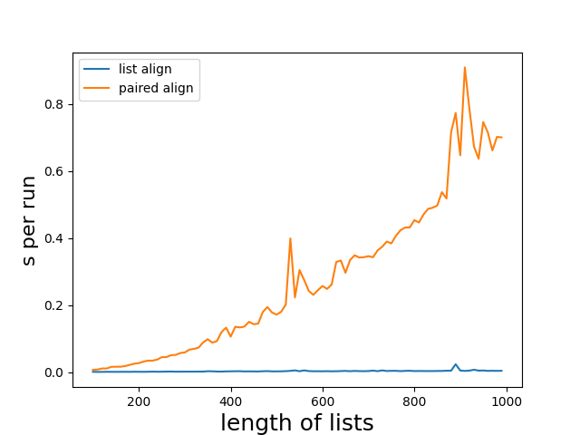
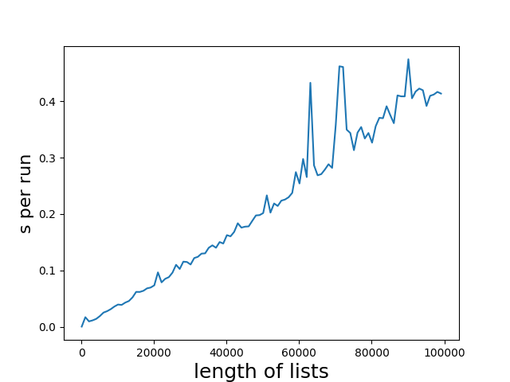

# LISTALIGN

is a tiny package for aligning two sequences of strings, that are tokenized differently in efficent manner. If you get some nasty tokenized strings and need to map them back to these nasty indices, this is a way.

```
seq_1 = 'Thequickbrownfoxjumpedoverthelazydog'.replace('o', 'o ').split(' ')
['Thequickbro', 'wnfo', 'xjumpedo', 'verthelazydo', 'g']

seq_2 = 'The quick brown fox jumped over the lazy dog'.replace('e', 'e ').split(' ')
['The', '', 'quick', 'brown', 'fox', 'jumpe', 'd', 'ove', 'r', 'the', '', 'lazy', 'dog']


>>> suffix_align(seq_1, seq_2)
[(0, 0), (0, 2), (0, 3), (1, 3), (1, 4), (2, 4), (2, 5), (2, 6), (2, 7), (3, 7), (3, 8), (3, 9), (3, 11), (3, 12), (4, 12)]

```

Or as a table:

```

i         w1         w2     i   j 
==================================
0     Thequickbro   The     0   0 
1     Thequickbro   quick   0   2 
2     Thequickbro   brown   0   3 
3            wnfo   brown   1   3 
4            wnfo   fox     1   4 
5        xjumpedo   fox     2   4 
6        xjumpedo   jumpe   2   5 
7        xjumpedo   d       2   6 
8        xjumpedo   ove     2   7 
9    verthelazydo   ove     3   7 
10   verthelazydo   r       3   8 
11   verthelazydo   the     3   9 
12   verthelazydo   lazy    3   11
13   verthelazydo   dog     3   12
14              g   dog     4   12
```

They have to sum up to the same string. So if your texts are in the same order and have the same characters, this can be your solution. If not remove the differing characters and get them in the same order. Difflib has some tools to make the strings similar. https://docs.python.org/3/library/difflib.html

It does - without the fuzzyness - something similar as https://pypi.org/project/paired/ avoiding the O^3 complexity and without some errors. On my machine it aligns 100000 words in 500ms. With paired you will need more and stick to  under 1000 words. The same example used above does not work well with paired:

```

i         w1         w2      i     j 
=====================================
0             xxx   The     None   0 
1             xxx           None   1 
2             xxx   quick   None   2 
3             xxx   brown   None   3 
4             xxx   fox     None   4 
5             xxx   jumpe   None   5 
6             xxx   d       None   6 
7             xxx   ove     None   7 
8     Thequickbro   r          0   8 
9            wnfo   the        1   9 
10       xjumpedo              2   10
11   verthelazydo   lazy       3   11
12              g   dog        4   12
```

The algorithm working is a custom suffix tree, that remembers position of both lists, that were fed in. It seems to have O(n)- time complexity. No actual string comparison is involved. 






This is, because the alignment problem is not solved like a classical alignment problem, that is bound to O^2 to construct a matrix, but like iterating through both lists once at the same time. Even if it looks like an alignment problem, it's not necessarily one.

## Get it

```
pip install listalign
```

# Run it

```
suffix_align(seq_1, seq_2)
```

# What's next

* add some fuzzyness
* diff-like support, that detects shifts between the sequences
* add parallelisation abilities

# Contribute

If there is something bad about it, contact me on the issue tracker or via mail

# License

This is licensed under the GPL v3 license, in favor of all these good code example we learn from.
